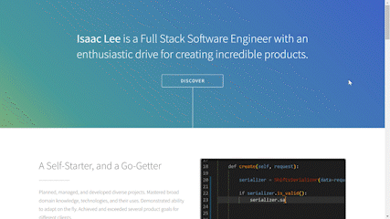

<h2 align="center"><u>Portfolio</u></h2>

<h4 align="center"> https://isaaclee.org/ </h4>

	

 

### [+] Description
This is the codebase for my personal website/portfolio: http://isaaclee.org

The website is made using SvelteKit (https://kit.svelte.dev/). I usually make clients in React these days, but I decided to dabble in a newer framework just to see what it's like.

Using Svelte allowed me to quickly put together my portfolio website and deploy it. It was the right tool for the job and I'm glad I used it.

This website is being hosted on my Raspberry Pi in a Linux environment and is being connected to my domain via Cloudflare. Two Linux services are running on my Pi: One to run the webapp, and one to connect to Cloudflare.

If you want to run the website for yourself locally, clone the repository, and run `npm run dev`

### [+] Find me on 
